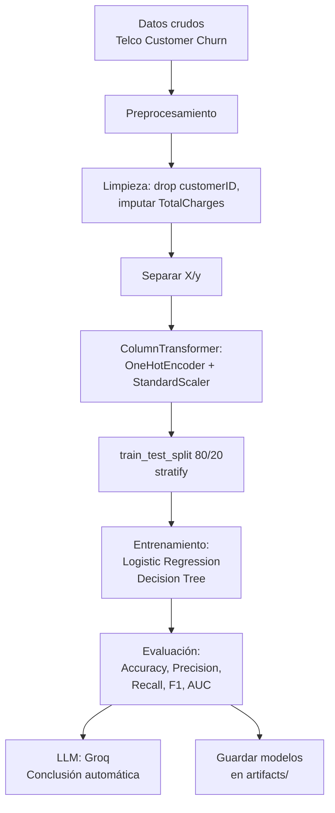

# ML Project Course 1 - Telco Customer Churn Prediction

## Problema de ML

**Problema de negocio:** La compañía de telecomunicaciones enfrenta una tasa de abandono de clientes (churn) del ~26.5%. Identificar clientes con alta probabilidad de abandonar permite implementar estrategias de retención proactivas.

**Tipo de ML:** Clasificación supervisada binaria.

**Objetivo:** Predecir si un cliente abandonará la compañía (Churn = Yes) o permanecerá (Churn = No) basado en características demográficas, de servicios contratados y de facturación.

**Métrica principal:** AUC-ROC, por ser una métrica robusta para clasificación binaria con clases desbalanceadas (73.5% No Churn vs 26.5% Churn).

---

## Diagrama de flujo del proyecto

---

## Descripción del dataset

**Origen:** Kaggle - [Telco Customer Churn](https://www.kaggle.com/datasets/blastchar/telco-customer-churn)

**Tamaño:** 7043 registros, 21 columnas (20 features + target)

### Diccionario de datos

| Columna | Tipo | Descripción |
|---|---|---|
| `customerID` | string | Identificador único del cliente (se elimina) |
| `gender` | categórica | Género: Male, Female |
| `SeniorCitizen` | binaria | 1 si es adulto mayor, 0 si no |
| `Partner` | binaria | Yes/No: tiene pareja |
| `Dependents` | binaria | Yes/No: tiene dependientes |
| `tenure` | numérica | Meses como cliente |
| `PhoneService` | binaria | Yes/No: tiene servicio telefónico |
| `MultipleLines` | categórica | Yes/No/No phone service |
| `InternetService` | categórica | DSL, Fiber optic, No |
| `OnlineSecurity` | categórica | Yes/No/No internet service |
| `OnlineBackup` | categórica | Yes/No/No internet service |
| `DeviceProtection` | categórica | Yes/No/No internet service |
| `TechSupport` | categórica | Yes/No/No internet service |
| `StreamingTV` | categórica | Yes/No/No internet service |
| `StreamingMovies` | categórica | Yes/No/No internet service |
| `Contract` | categórica | Month-to-month, One year, Two year |
| `PaperlessBilling` | binaria | Yes/No |
| `PaymentMethod` | categórica | Electronic check, Mailed check, Bank transfer, Credit card |
| `MonthlyCharges` | numérica | Cargo mensual en USD |
| `TotalCharges` | numérica | Cargo total acumulado en USD |
| `Churn` | binaria (target) | Yes: abandonó, No: permanece |

---

## Model Card

### Información general

- **Fecha:** Junio 2026
- **Tipo de modelo:** Clasificación binaria supervisada
- **Algoritmos:** Regresión Logística, Árbol de Decisión
- **Frameworks:** scikit-learn 1.9.0, pandas 3.0.3, numpy 2.4.6
- **LLM:** Groq (llama-3.1-8b-instant)

### Datos de entrenamiento

- **Origen:** Telco Customer Churn (Kaggle)
- **Tamaño total:** 7043 registros
- **Split:** 80/20 estratificado (Train: 5634, Test: 1409)
- **Features:** 30 después de OneHotEncoder + StandardScaler (4 numéricas + 26 dummies)
- **Distribución clases:** 73.5% No Churn, 26.5% Churn

### Rendimiento

| Modelo | Accuracy | Precision | Recall | F1-Score | AUC-ROC |
|---|---|---|---|---|---|
| **Logistic Regression** | **0.8055** | **0.6572** | **0.5588** | **0.6040** | **0.8420** |
| Decision Tree | 0.7942 | 0.6296 | 0.5455 | 0.5845 | 0.8284 |

### Limitaciones

- Recall limitado (~56%): el modelo no detecta una proporción significativa de clientes que sí abandonarán.
- Las clases están desbalanceadas (73.5/26.5), lo que sesga el accuracy hacia la clase mayoritaria.
- No se incluyen variables temporales ni de interacción con el servicio (ej. número de llamadas al soporte).

### Uso previsto

El modelo está diseñado para su uso como herramienta de soporte en campañas de retención. Los clientes clasificados como "Churn" con alta probabilidad (>0.7) deben ser priorizados para intervenciones de retención. No debe usarse como único criterio de decisión sin supervisión humana.

---

## Resultados con métricas offline y online

### Offline (evaluación en test set)

| Modelo | Accuracy | Precision | Recall | F1-Score | AUC-ROC |
|---|---|---|---|---|---|
| Logistic Regression | 80.55% | 65.72% | 55.88% | 60.40% | 84.20% |
| Decision Tree | 79.42% | 62.96% | 54.55% | 58.45% | 82.84% |

**Mejor modelo:** Regresión Logística (AUC superior: 0.8420).

### Online (monitoreo en producción)

Para un despliegue en producción, se recomienda monitorear:

- **Latencia:** Tiempo de inferencia por predicción (< 100ms).
- **Data Drift:** Cambios en la distribución de features (usando PSI o KS-test).
- **Concept Drift:** Caída en AUC por debajo de 0.75 como umbral de alerta.
- **Dashboard:** Tablero con métricas actualizadas cada 24 horas (accuracy, precision, recall, throughput).

---

## Conclusiones

1. **Regresión Logística** superó al Árbol de Decisión en todas las métricas, con un AUC de 0.8420 frente a 0.8284.

2. El **recall es el punto débil** (~56%): el modelo falla en detectar el 44% de los clientes que sí abandonarán. Se recomienda mejorar con:
   - Feature engineering (crear variables de interacción entre servicios)
   - Balanceo de clases (SMOTE o class_weight)
   - Probar modelos más complejos (Random Forest, XGBoost)

3. **Conclusión del LLM (Groq):** El modelo tiene buen accuracy general pero bajo recall, lo que implica que se están perdiendo clientes en riesgo. Se recomienda implementar campañas proactivas de fidelización (ofertas personalizadas, programas de lealtad) dirigidas a clientes con alta probabilidad de churn.

4. **Próximos pasos:**
   - Integrar el script `src/train_pipeline.py` para automatizar reentrenamiento
   - Implementar monitoreo de drift en producción
   - Explorar modelos ensemble y deep learning
