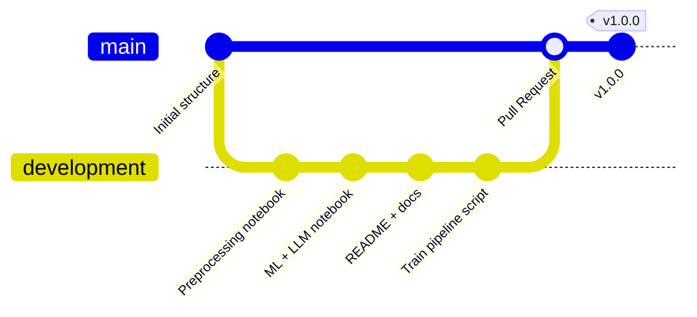

# Estrategia Git

Este proyecto sigue **GitHub Flow**, un flujo de trabajo basado en ramas que permite desarrollo paralelo y despliegue continuo.

## Flujo utilizado

1. **Rama `main`**: Contiene la versión estable y liberada del proyecto (v1.0.0).
2. **Rama `development`**: Rama principal de trabajo donde se integran los cambios incrementales.
3. **Commits atómicos**: Cada commit representa un cambio completo y funcional:
   - `chore: estructura inicial del proyecto`
   - `feat: notebook de preprocesamiento con encoding y split`
   - `feat: notebook de ML con regresión logística, árbol de decisión y LLM`
   - `docs: README completo con model card y git strategy`
   - `feat: script train_pipeline con POO y argparse`
4. **Pull Request**: Los cambios se integran de `development` a `main` mediante una PR revisada y aprobada.
5. **Versionado semántico**: Se utiliza el tag `v1.0.0` para el release, siguiendo el formato MAJOR.MINOR.PATCH.

## Diagrama

